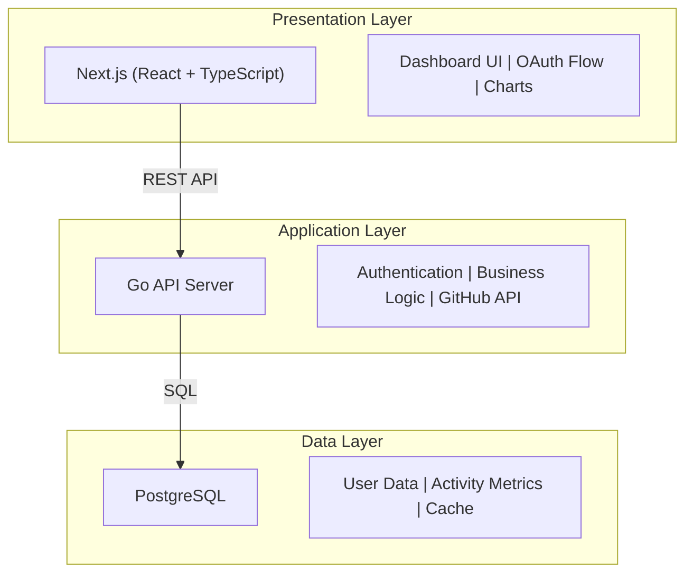

# DevMetrics Hub
A dashboard that analyzes GitHub activity and generates automated reports.

## Tech Stack

- **Frontend**: Next.js
- **Backend**: Go
- **Auth**: OAuth 2.0, JWT
- **Database**: PostgreSQL
- **Infrastructure**: AWS ECS, Docker, GitHub Actions

## Installation

```bash
git clone https://github.com/Takas-sea/DevMetrics-Hub.git
cd DevMetrics-Hub
docker-compose up -d
```

## Why

This project was built to strengthen practical skills in backend development and infrastructure design using Go and AWS.
Beyond learning, it implements quantitative visualization of GitHub activity data as a way to support continuous growth for engineers.

## Architecture

### System Overview



### Data Flow

**1. Authentication Flow**
```
User → Next.js → GitHub OAuth → JWT Token → Go Backend → PostgreSQL
```

**2. Data Collection Flow**
```
Scheduled Job → Go Service → GitHub API → Data Processing → PostgreSQL
```

**3. Visualization Flow**
```
User Request → Next.js → Go API → PostgreSQL Query → JSON Response → Chart Rendering
```

### Core Components

| Component | Technology | Responsibility |
|-----------|-----------|----------------|
| **Frontend** | Next.js 14, React, TypeScript | UI rendering, client-side routing, data visualization |
| **Backend API** | Go 1.21, Gin framework | REST endpoints, authentication, business logic |
| **Data Store** | PostgreSQL 15 | Persistent storage, complex queries |
| **Authentication** | OAuth 2.0, JWT | Secure user authentication with GitHub |
| **External API** | GitHub REST API v3 | Fetch user activities, commits, PRs |
| **Deployment** | Docker, AWS ECS | Containerization and orchestration |
| **CI/CD** | GitHub Actions | Automated testing and deployment |

### Deployment Architecture

```
GitHub (Code) → GitHub Actions (CI/CD) → AWS ECR (Images) 
    → AWS ECS (Containers) → ALB (Load Balancer) → Users
```

## Design Choices

- **Go**: High performance and concurrency capabilities make it ideal for fetching and processing large amounts of GitHub data
- **Next.js**: Rich ecosystem with abundant online resources, enabling high learning and development efficiency
- **PostgreSQL**: Highly extensible, allowing easy feature additions and optimizations as the project grows
- **JWT Authentication**: Stateless authentication ensures scalability
- **Docker**: Guarantees consistency between development and production environments, simplifying deployment
- **AWS ECS**: Low operational overhead for containers with easy scaling


## Author

Takas-sea
GitHub: [@Takas-sea](https://github.com/Takas-sea)
