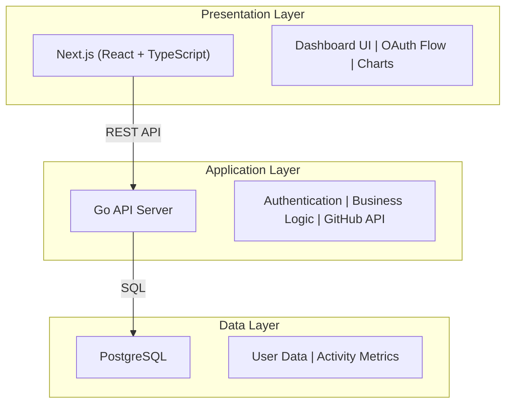
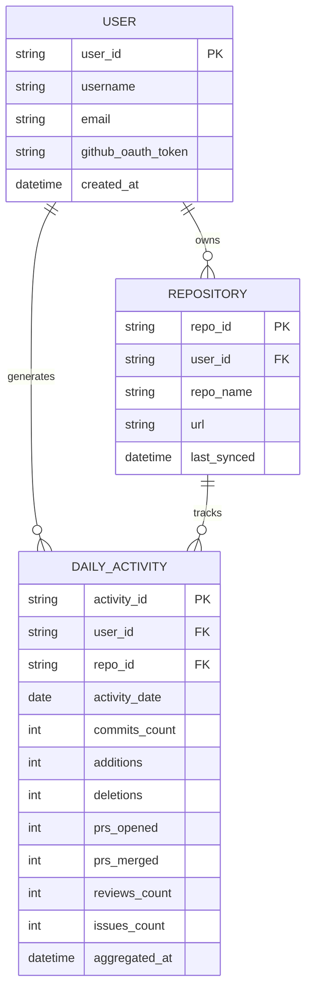

# DevMetrics Hub
A dashboard that analyzes GitHub activity and generates automated reports.

## Tech Stack

- **Frontend**: Next.js 14, React 18, TypeScript
- **Backend**: Go 1.26.0, Gin framework
- **Auth**: OAuth 2.0, JWT
- **Database**: PostgreSQL 15
- **Infrastructure**: AWS ECS, Docker, GitHub Actions

## Installation

```bash
git clone https://github.com/Takas-sea/DevMetrics-Hub.git
cd DevMetrics-Hub
docker-compose up -d
```

## Why

This project was built to strengthen practical skills in backend development and infrastructure design using Go and AWS.
Beyond learning, it implements quantitative visualization of GitHub activity data as a way to support continuous growth for engineers.

## Project Scope

### In Scope

**Core Features**
- ✅ GitHub OAuth authentication
- ✅ Personal dashboard for individual developers
- ✅ GitHub activity data collection (commits, PRs, reviews, issues)
- ✅ Daily activity aggregation and storage
- ✅ Basic metrics visualization (charts, graphs)
- ✅ Time-series analysis (daily, weekly, monthly trends)
- ✅ Single repository and multi-repository views

**Technical Implementation**
- ✅ Next.js frontend with TypeScript
- ✅ Go backend API with Gin framework
- ✅ PostgreSQL for data persistence
- ✅ Docker containerization
- ✅ AWS ECS deployment
- ✅ CI/CD via GitHub Actions
- ✅ Scheduled data synchronization (once daily)

**Non-Functional**
- ✅ Support 10-50 concurrent users
- ✅ API response time < 200ms
- ✅ Best effort availability

### Out of Scope

**Features**
- ❌ GitLab/Bitbucket integration (GitHub only)
- ❌ Team/organization analytics
- ❌ Real-time WebSocket updates (scheduled sync only)
- ❌ Machine learning predictions
- ❌ Mobile native apps (web only)
- ❌ On-premise deployment options
- ❌ Multi-language support (English only)
- ❌ Individual commit record storage (daily aggregation for commits only)

**Advanced Capabilities**
- ❌ Advanced access control/permissions
- ❌ Custom metric definitions
- ❌ API for third-party integrations
- ❌ Data export to external BI tools

### Constraints

- **Budget**: Limited to AWS free tier or minimal cost services
- **Timeline**: Personal learning project, no strict deadlines
- **Resources**: Solo developer project
- **GitHub API**: Rate limit of 5,000 requests/hour (authenticated)
- **Data Retention**: 90 days of daily activity data

### Assumptions

- Users have GitHub accounts
- Users grant OAuth permissions for repository access
- GitHub API remains stable and backward-compatible
- AWS services availability in target region
- Users access via modern web browsers (Chrome, Firefox, Safari, Edge)

## Architecture

### System Overview



### Data Flow

**1. Authentication Flow**
```
User → Next.js → GitHub OAuth → JWT Token → Go Backend → PostgreSQL
```

**2. Data Collection Flow**
```
Scheduled Job → Go Service → GitHub API → Data Processing → PostgreSQL
```

**3. Visualization Flow**
```
User Request → Next.js → Go API → PostgreSQL Query → JSON Response → Chart Rendering
```

### Core Components

| Component | Technology | Responsibility |
|-----------|-----------|----------------|
| **Frontend** | Next.js 14, React, TypeScript | UI rendering, client-side routing, data visualization |
| **Backend API** | Go 1.21, Gin framework | REST endpoints, authentication, business logic |
| **Data Store** | PostgreSQL 15 | Persistent storage, complex queries |
| **Authentication** | OAuth 2.0, JWT | Secure user authentication with GitHub |
| **External API** | GitHub REST API v3 | Fetch user activities, commits, PRs |
| **Deployment** | Docker, AWS ECS | Containerization and orchestration |
| **CI/CD** | GitHub Actions | Automated testing and deployment |

### Database Schema



**Data Retention Policy**
- `DAILY_ACTIVITY`: Records older than 90 days are automatically purged
- `USER` and `REPOSITORY`: Retained while account is active

**Security Notes**
- `github_oauth_token`: Encrypted at rest, encryption keys managed securely and not in application code
- JWT tokens: Short-lived access tokens (1 hour expiration)
- Sensitive tokens: Never logged or exposed in debug output

### Deployment Architecture

```
GitHub (Code) → GitHub Actions (CI/CD) → AWS ECR (Images) 
    → AWS ECS (Containers) → ALB (Load Balancer) → Users
```

## Design Choices

- **Go**: High performance and concurrency capabilities make it ideal for fetching and processing large amounts of GitHub data
- **Next.js**: Rich ecosystem with abundant online resources, enabling high learning and development efficiency
- **PostgreSQL**: Highly extensible, allowing easy feature additions and optimizations as the project grows
- **JWT Authentication**: Stateless authentication ensures scalability
- **Docker**: Guarantees consistency between development and production environments, simplifying deployment
- **AWS ECS**: Low operational overhead for containers with easy scaling
- **Worker Pool Pattern**: Limits concurrent GitHub API requests with 2 workers and request throttling to stay within rate limits (5,000 req/h)
- **Daily Aggregation**: Reduces API calls by syncing once per day instead of real-time polling

## Non-Functional Requirements

| Requirement | Target | Details |
|-------------|--------|---------|
| **Performance** | Response Time < 200ms | API endpoints and dashboard queries optimized for sub-200ms responses |
| **Availability** | Best Effort | Single-region deployment with basic health checks and auto-recovery |
| **Scalability** | 10-50 Concurrent Users | Single ECS task and RDS instance, sufficient for target load |
| **Security** | OAuth 2.0 + JWT | Secure authentication, HTTPS-only communication, encrypted token storage |
| **Rate Limiting** | GitHub API Protection | Worker pool with 2 concurrent workers and request throttling to stay within 5,000 requests/hour limit |
| **Latency** | Daily Data Sync | Scheduled jobs run once daily for aggregated metric updates |
| **Maintainability** | Long-term Support | Modular architecture enables easy feature additions and dependency updates |
| **Monitoring** | CloudWatch Integration | Metrics, logs, and alarms for proactive issue detection |

## Author

Takas-sea
GitHub: [@Takas-sea](https://github.com/Takas-sea)
